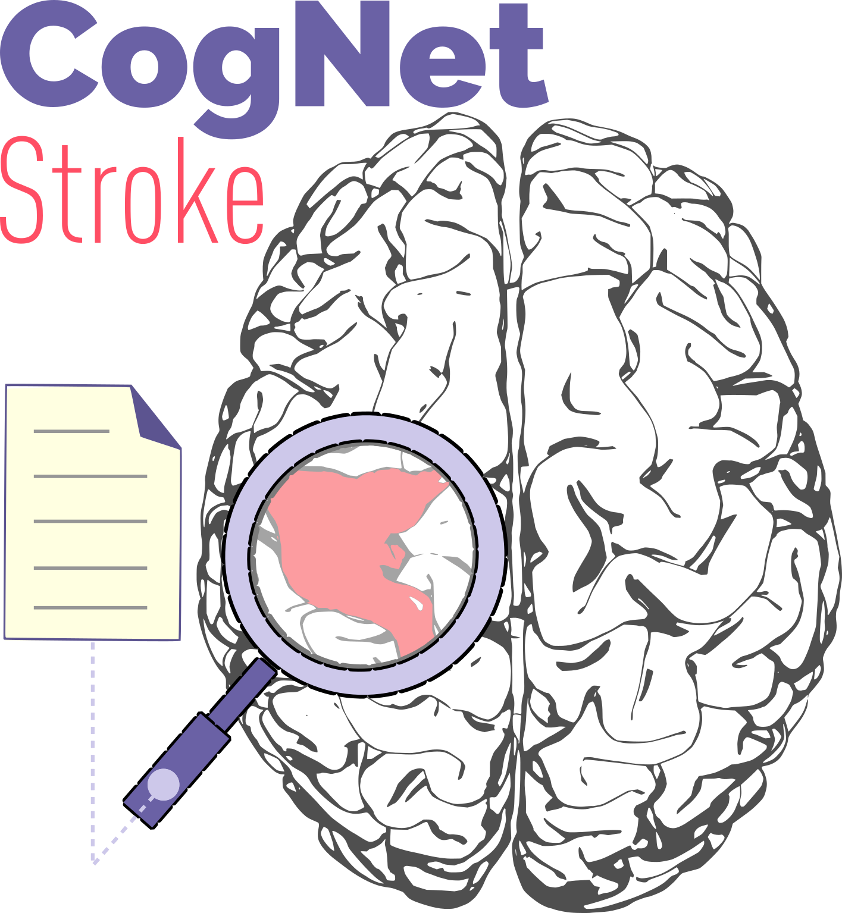
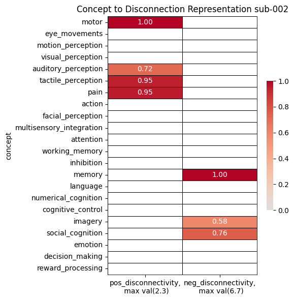

# CogNet-Stroke

Is a meta-analytic brain functional decoding tool designed to predict cognitive deficits after stroke. The tool integrates Lesion-Network Mapping (LNM) with meta-analytic concept maps derived from [Neurosynth](https://neurosynth.org/), enabling the identification of the cognitive domains most affected by stroke-induced network disruptions. CogNet-Stroke offers a framework for individualized cognitive-deficit profiling, with implications for personalized rehabilitation strategies in stroke recovery.

<p align="center">
    
</p>

## Background
Understanding how brain lesions from a stroke affect a patient's behavior is critical for optimizing their care. Traditionally, clinicians link the location of a lesion to a specific functional problem. A major advance in this area is **LNM**, a technique based on the idea that symptoms arise not just from the lesion itself, but from the disruption of entire brain networks.

However, a key challenge remains. Standard LNM often links network disruptions to performance on a specific task or a single symptom. This can be misleading due to the "**reverse inference problem**": just because a brain region is active doesn't mean we can definitively know which cognitive process is engaged. Many regions are active during many different tasks, making it difficult to pinpoint the precise cognitive deficit.

To overcome this, researchers have developed large-scale meta-analytic databases like **Neurosynth**. These databases aggregate thousands of fMRI studies to enable "functional decoding"—a data-driven way to infer mental processes from brain activation patterns.

## Description

**COGNET-STROKE** is a computational framework designed to provide a more comprehensive understanding of cognitive deficits after a stroke. It addresses the limitations of traditional methods by integrating two powerful techniques:

1. **Lesion Network Mapping (LNM)**: To precisely identify the brain networks disrupted by an individual patient's lesion.

2. **Meta-analytic Functional Decoding**: To interpret what these network disruptions *mean* in terms of cognitive function, using data from Neurosynth.

Instead of just mapping a lesion to a single symptom, `CogNet-stroke` generates a **score** based on the similarity of the lesion dysconnectivity patterns to several concept maps. These maps highlight the broader cognitive functions (e.g., "attention," "memory," "language").

The primary goal is to provide clinicians with a data-driven tool to facilitate **individualized rehabilitation strategies**. By understanding the full cognitive profile of a patient's network disruption, therapeutic interventions can be more precisely tailored to their needs.

## Pre-requisites

### Software
`CogNet-stroke` is a python-based tool. You only need:
1. `Python 3.12.3`
2. [uv](https://docs.astral.sh/uv/getting-started/installation/)

### Data
1. You need *3D nifti files* of the each patient *binary* lesion mask. The masks must be registered to the `MNI152 2mm standard`. If your original image is a Computered Tomography (CT), [You might want to use our package to do that registration](https://github.com/compneurobilbao/CTLesion2MNI152). Lesion masks should be stored in `data/lesion` and with filenames `sub-XXX.nii.gz`.

2. Functional dysconnectivity maps derived from the lesion masks. [You might want to use our package to generate the maps](https://github.com/compneurobilbao/lnm). Dysconnectivity maps should be stored in `data/functional_dysconnectivity` and with filenames `sub-XXX.nii.gz`.

## How to install `CogNet-stroke`
After cloning the repo, you just have to execute:

```
uv sync
source .venv/bin/activate 
``` 

## How to use `CogNet-stroke`

First, you have to generate the concept maps:

```
generate_concept_maps --out_dir=data/results --vocab=LDA100 --concept_mapping=src/generate_concept_maps/data/LDA100_term_to_concept.json

generate_concept_maps --out_dir=data/results --vocab=LDA50 --concept_mapping=src/generate_concept_maps/data/LDA50_term_to_concept.json
```

Then, generate the report:

```
generate_cdr_report --lesion_data_dir=data/lesion --lnm_data_dir=data/functional_dysconnectivity --concept_data_dir=data/results/concept_maps --out_dir=data/results 
```

## Outputs

1. Table reporting concepts significantly altered given the patient's lesion. Here is an example: 

<p align="left">
    
</p>

2. *Bar plots* counting the affected concepts in your data.
3. A `.csv file` with the results per patient and concept.

## Cite